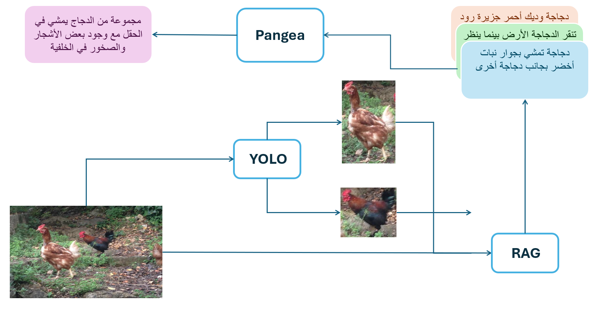

# RAGea


RAGea is a retrieval-augmented multilingual image captioning pipeline built on top of the Pangea-7B vision–language model. We build a FAISS datastore from COCO-35L using SigLIP-2 embeddings and, at inference time, retrieve the top-K similar captions to use as in-context examples for the model. To better handle complex scenes, we also explore an object-aware variant that uses YOLO to retrieve captions for detected regions. We evaluate our model on the XM-100 benchmark and find modest but consistent gains over zero-shot captioning, especially for low-resource languages, while maintaining comparable performance in high-resource languages. 



### Installation

```bash
python -m venv .venv
pip install -r requirements.txt
```
#Building Data Store

First, download the COCO-35L dataset from the following link:
`https://huggingface.co/datasets/SEACrowd/coco_35l/tree/main`
and then use the following command to build the datastore:

```bash
cd src/ragea
python build_add_coco_index.py <name> ass <input_path>
```

### Evaluate XM-100

Run evaluation with:

```bash
python evaluate_xm100.py \
  --langs en fr de \
  --vector_store_name coco_index \
  --k 4 \
  --search_type similarity \
  --run_name my-xm100-run
```
--langs – space-separated language codes (e.g., en fr de) or all to evaluate every split

--vector_store_name – optional FAISS vector store; if omitted, no retrieval is used

--k – number of captions retrieved per image (default: 4)

--search_type – retrieval method: similarity or mmr

--run_name – experiment name; outputs go to outputs/experiments/<run_name>/

### Conclusion

RAGea shows that a simple, training-free RAG setup—offline indexing with FAISS and inference-time retrieval—can reliably improve multilingual captioning quality, particularly for low-resource languages, without harming performance in high-resource ones. The object-aware YOLO variant further strengthens grounding in complex scenes by enriching prompts with region-level captions. Future work includes scaling the datastore to larger, more diverse benchmarks and extending this retrieval-augmented design to other multimodal tasks such as VQA and multimodal reasoning.

